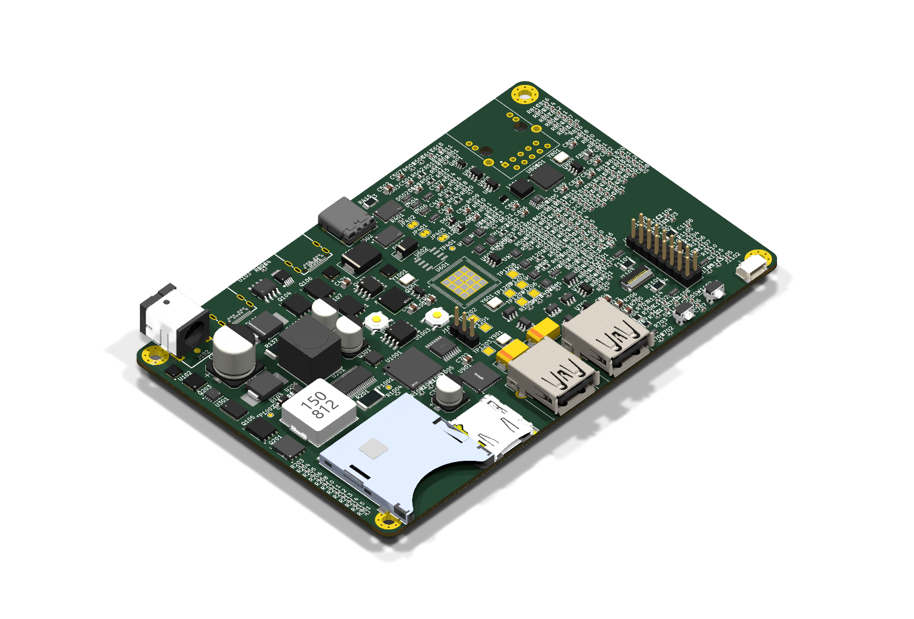

# odeck

An open-hardware USB-C deck you can order fully assembled from JLCPCB and use as a bare PCB the day it
arrives: USB-C upstream, display out, USB-A, SD + microSD, 2.5 GbE, up to **140 W** pass-through
charging, a small status LCD instead of a wall of LEDs, and an RP2350 you can reprogram.

The long-term goal is a **40 Gbps USB4** deck. The first board, **odeck-10**, is a 10 Gbps USB-C deck
built only from parts JLC stocks, to prove out everything the USB4 version will reuse: power, PD,
firmware, display, card reader, Ethernet, board shape and silkscreen.



> **Status (2026-10): schematic complete and reviewed, rough placement only — not routed, not
> fabricated.** The render above is the automatic first placement (`hardware/odeck-10/placement.py`),
> not a finished layout. The LCD panel and the two JAE USB-C receptacles have no 3D model yet, and the
> GPIO header is shown although it ships unpopulated. More views: [top](docs/images/odeck-10-top.png) ·
> [bottom](docs/images/odeck-10-bottom.png).

## odeck-10 at a glance

| | |
|---|---|
| Upstream | USB-C, USB 3.2 Gen 2 (10 Gbps) + DisplayPort Alt Mode (2-lane HBR3, 4K60) |
| Charging the laptop | USB PD 3.1 EPR up to **140 W** (28 V × 5 A), 100 W SPR fallback |
| Power inputs | USB-C PD in (EPR, up to 48 V) · DC barrel 5.5×2.5 mm 9–24 V · or bus-powered from the laptop |
| Display | Downstream USB-C with DP Alt Mode (works with any USB-C→HDMI/DP cable) |
| USB | 2× USB-A 10 Gbps (BC1.2 charging), downstream USB-C 10 Gbps, forced-5 V "dumb charge" mode with auto-off |
| Storage | SD + microSD (Genesys GL3224) |
| Network | 2.5 GbE (Realtek RTL8156BG) |
| Brains | RP2350B — drives a 2.0" 320×240 IPS status LCD, reads every PD contract / link speed / temperature / port current, and updates every other chip's firmware from a single UF2 |
| Hackable | 2 user buttons, unpopulated GPIO header (series-R + ESD protected), Qwiic connector, SWD |
| Board | 6-layer JLC impedance stack-up (JLC061611-1080A), ~130×85 mm (provisional), ~800 parts, all JLC stock |

### Architecture

```
 Laptop USB-C ══ TUSB1064 ══ USB 10G ══► Microchip USB7206C hub ──► USB-A ×2 · GL3224 (SD/µSD) · RTL8156BG (2.5GbE)
 (10G + DP alt,      ║                                        └──► downstream USB-C ◄══ TUSB1046 ◄═ DP 2-lane
  140 W EPR out)     ╚═════════════ DP lanes + AUX ═══════════════════════════════╝      (USB2 port → RP2350)

 Infineon PMG1-S3: laptop port (EPR source, DP UFP_D) + downstream port (5 V/3 A, DP DFP_D)
 TI TPS26750: USB-C PD-in sink (up to 48 V)        Barrel 9–24 V ─┐
 PD-in ─► ideal-diode OR ◄──────────────────────────────────────────┘ → VIN 9–48 V
   VIN ─► LM51770 buck-boost → 5–28 V × 5 A → laptop (gated, interlocked, hardware OVP)
   VIN ─► LM5148 → 5 V / 8 A → 3.3 V, 1.15 V …     laptop VBUS ─► 5 V when bus-powered
 RP2350B: LCD, buttons, I²C to PD controllers / INA2xx power monitors / 8× TMP1075 / hub SMBus
```

## Repository layout

| Path | What |
|---|---|
| `docs/requirements.md` | Goals and constraints for the whole project (USB4 end goal) |
| `docs/odeck-10.md` | **Start here** — odeck-10 architecture, part choices, design rules, integration items, status |
| `docs/power-budget.md`, `docs/board-layout.md` | Power/thermal budget, outline & placement plan, stack-up |
| `docs/design/*.md` | Per-sheet design notes with every calculation |
| `docs/review/*.md` | Independent schematic and footprint reviews, with resolutions |
| `docs/research/*.md` | Chip, JLC capability and sourcing research (incl. why 40G is not buildable from JLC stock yet) |
| `hardware/odeck-10/` | KiCad 10 project. Schematic sheets are **generated** from `sheets/*.py` |
| `hardware/lib/` | Project symbols, footprints (all checked against manufacturer drawings) and 3D models |
| `tools/schgen/` | Schematics-as-code generator + netlist verification |
| `tools/pcbsync.py` | Scripted "update PCB from schematic" (keeps placed parts where they are) |
| `tools/bom_check.py` | Checks every part against live JLC stock (rule: JLC parts only, ≥ 5 in stock) |
| `tools/import_lcsc.sh` | Imports LCSC parts (symbol/footprint/3D) via easyeda2kicad |

## Working on it

Requires KiCad 10 (`/Applications/KiCad` on macOS) and Python 3.10+.

```sh
# regenerate every schematic sheet from its Python source and verify the netlist
python3 hardware/odeck-10/sheets/build_all.py

# electrical rules check
/Applications/KiCad/KiCad.app/Contents/MacOS/kicad-cli sch erc hardware/odeck-10/odeck-10.kicad_sch

# every part in JLC stock?  (+ cost summary)
python3 tools/bom_check.py

# push schematic changes into the PCB (uses KiCad's bundled Python)
/Applications/KiCad/KiCad.app/Contents/Frameworks/Python.framework/Versions/3.9/bin/python3 tools/pcbsync.py hardware/odeck-10

# render
/Applications/KiCad/KiCad.app/Contents/MacOS/kicad-cli pcb render --side top -o top.png hardware/odeck-10/odeck-10.kicad_pcb
```

Edit schematics by editing `hardware/odeck-10/sheets/<sheet>.py`, never the generated `.kicad_sch`.
Inter-sheet nets are declared in `tools/schgen/nets.py`.

## Roadmap

1. **odeck-10** (10 Gbps, JLC parts only) — schematic ✅ · review ✅ · footprints ✅ · placement ⏳ ·
   routing · firmware · order prototypes · bring-up
2. **20/40 Gbps USB4** — waiting on a USB4 hub controller (and its firmware) that can actually be sourced;
   see `docs/research/usb4-hub.md`.

## License

- **Hardware** — everything under `hardware/` (schematics, sheet sources, PCB, symbols, footprints, 3D
  models we created) and the hardware documentation in `docs/`: **CERN-OHL-P v2**
  ([LICENSE-HARDWARE](LICENSE-HARDWARE)).
  Copyright © 2026 Karpelès Lab Inc.
- **Software** — `tools/` and future firmware: **MIT** ([LICENSE-SOFTWARE](LICENSE-SOFTWARE)).

Not covered: third-party datasheets in `docs/datasheets/` (copyright of their manufacturers, included for
reference), footprints/3D models derived from KiCad's libraries or LCSC/EasyEDA (their own terms), and vendor
firmware/libraries (e.g. Infineon's PD stack), which are fetched at build time and never committed.
